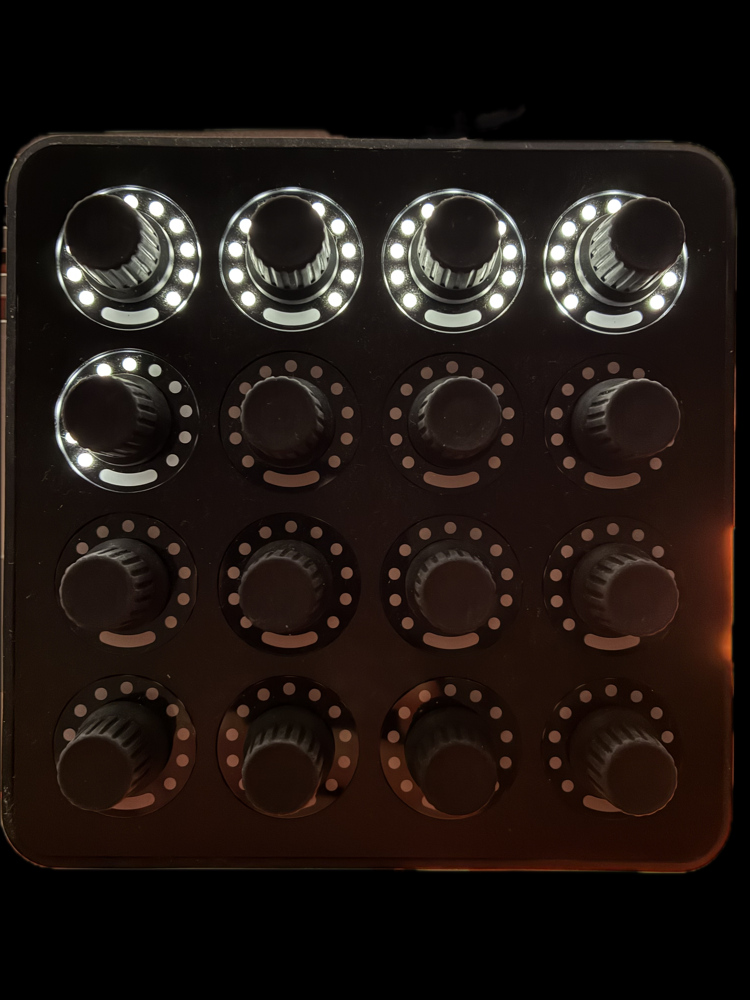

# Twister Beat Indicator

  

> ⚠️ **Status:** This device is currently in active development (WIP). Features and behavior may change.

## Overview
Twister Beat Indicator is a Max for Live MIDI device for the MIDI Fighter Twister. It mirrors Ableton Live's current bar/beat position on the Twister LEDs so you can track timing at a glance during performance.

## Features
- Transport-synced beat indicator
- Follows playhead position, including timeline jumps (jump-safe)
- Low CPU usage (typically ~0–1%)
- Built for live performance workflows
- Metro-based timing with transport correction for stable sync

## Installation
1. Download or clone this project.
2. Open Ableton Live.
3. Drag `Twister Beat Indicator.amxd` onto a MIDI track.
4. Ensure your MIDI Fighter Twister is connected and mapped in Live's MIDI settings.

## Usage
1. Start Live's transport.
2. Watch the Twister LEDs update with the current bar/beat position.
3. Move the playhead or jump in the timeline; the indicator will re-align automatically.

## Requirements
- Ableton Live with Max for Live support
- MIDI Fighter Twister
- `Twister Beat Indicator.amxd`
